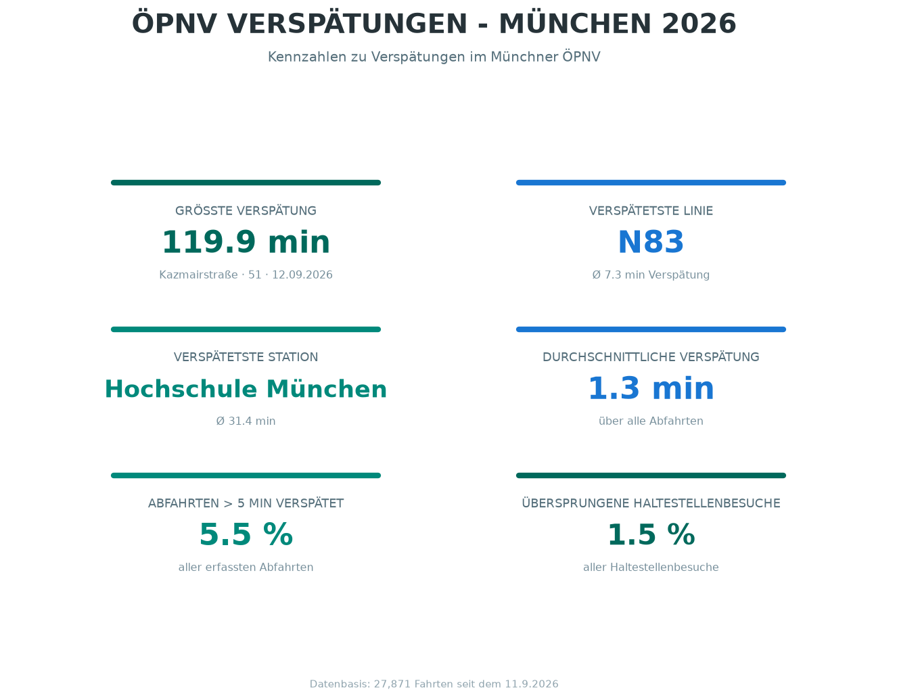
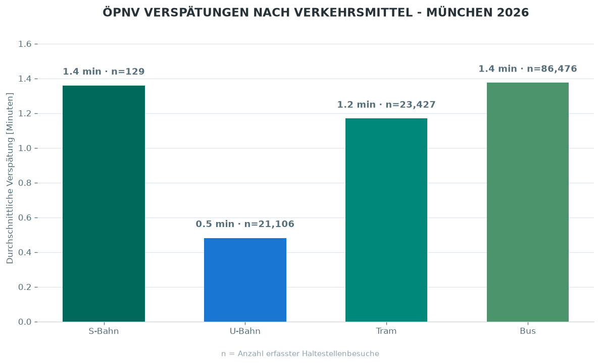
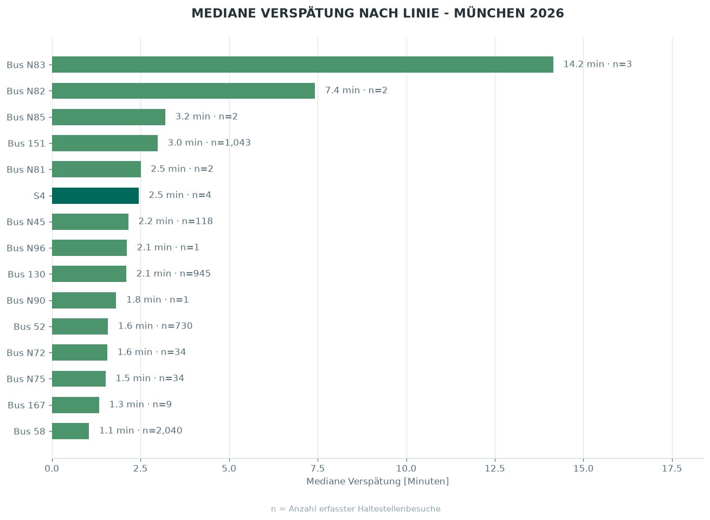

# MVV and MVG Delay Tracker

This project is creating a publicly available dataset of MVV and MVG delays per station by running a cron job regularly to examine the real-time data feed and compare it with the scheduled timetables.

## Data

The dataset is documented and saved in
[this folder](data/realtime/).

## Visualizations

## Sources

The data used for this project is provided by
[GTFS für Deutschland](https://www.gtfs.de/) and is based on the
NeTEx dataset provided by DELFI e.V.

The provider states that no guarantee is given regarding the correctness, continuous availability, or completeness of the real-time data contained in the stream. The stream is provided as a beta version.

**License:** Creative Commons Attribution 4.0 International (CC BY 4.0)  

**Sources:** https://www.gtfs.de/en/feeds/de_nv/, https://realtime.gtfs.de/realtime-free.pb

**First accessed:** September 2026

**Last accessed:** September 2026
