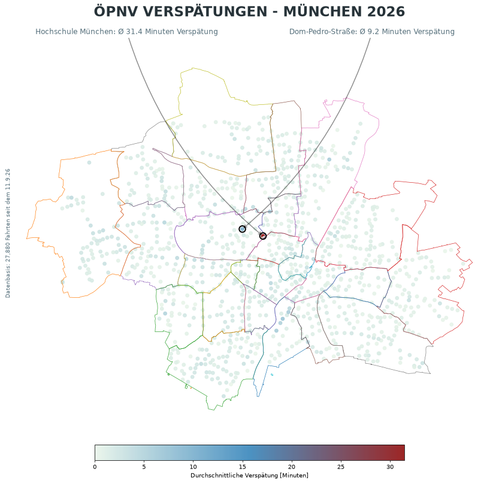

# MVV Delay Tracker

This project is creating a publicly available dataset of MVV delays per station by running a cron job regularly to examine real-time departure data and compare scheduled departure times with actual departure times.

## Delay Map

## Data

The data used for this project is provided by
[GTFS für Deutschland](https://www.gtfs.de/) and is based on the
NeTEx dataset provided by DELFI e.V.

**License:** Creative Commons Attribution 4.0 International (CC BY 4.0)  
**Source:** https://www.gtfs.de/en/feeds/de_nv/  
**Last accessed:** September 2026
